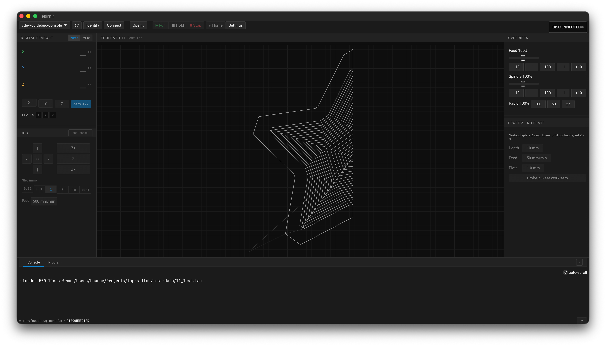

# Galdr

**Galdr** is a CNC PCB-milling system: custom [grblHAL](https://github.com/grblHAL)-compatible firmware for an
**ESP32-S3** motion controller, plus **skirnir**, a native desktop GCode sender that streams to it over USB.

The firmware drives three stepper axes through silent [TMC2209](https://www.trinamic.com/) drivers and a WS55-220
spindle, speaks the grbl v1.1 / grblHAL streaming protocol, and is built around a strict hardware-abstraction boundary
so the entire motion pipeline — GCode parsing, look-ahead planning, the homing state machine, coordinate systems —
is pure `no_std` Rust that compiles and unit-tests on the host with stock Rust (600+ tests, no hardware required).



> *skirnir, the host-side GCode sender: the connection toolbar and state badge, the work/machine DRO and jog pad,
> feed/spindle/rapid overrides, a Z-probe panel, X/Y/Z endstop (`LIMITS`) indicators, the program console, and the
> toolpath viewport rendering a loaded program.*

---

## Workspace layout

Galdr is a Cargo workspace of four crates:

| Crate | Role |
|-------|------|
| [`crates/firmware-core`](crates/firmware-core) | Pure, `no_std`, **host-tested** logic: GCode parser, motion planner, segment generator, grblHAL protocol/state machine, the homing state machine, coordinate systems, settings model, and the TMC2209 codec. No esp-hal dependency. |
| [`crates/firmware`](crates/firmware) | The **ESP32-S3** binary wiring `firmware-core` to the hardware (esp-hal 1.0 + Embassy on the esp-rtos host): USB CDC comms, the dual-core task split, RMT step generation, the TMC UART bus, flash persistence, and the limit-switch inputs. |
| [`crates/galdr-proto`](crates/galdr-proto) | The shared Protocol Buffers schema (micropb) for the settings/coordinate wire format — used by both the firmware flash records and the `$PBX` host-sync channel. |
| [`crates/skirnir`](crates/skirnir) | The native GCode sender: an **egui/eframe** GUI on top of a framework-agnostic `tokio-serial` streaming engine. |

## Hardware

| Subsystem | Detail |
|-----------|--------|
| Controller | ESP32-S3 (Xtensa LX7), native USB Serial/JTAG to the host |
| Steppers | 3× X/Y/Z via TMC2209 on a shared single-wire UART bus (CRC8-ATM datagrams) |
| Step generation | One dedicated RMT TX channel per axis (ch0/1/2) |
| Endstops | Normally-closed micro-switches on GPIO10/11/12, internal pull-ups, broken-wire fail-safe |
| Spindle | WS55-220 via LEDC PWM → RC + op-amp → 0–10 V |

See [`docs/00-architecture.md`](docs/00-architecture.md) for the full hardware/GPIO manifest and firmware design
(DOC-00 – DOC-09).

## Status

The firmware (`firmware-core` + `firmware` + `galdr-proto`) is substantially implemented and host-tested:

- ✅ GCode → planner → motion pipeline (look-ahead, junction-deviation cornering, trapezoidal segment generation)
- ✅ grblHAL streaming protocol (character-counting flow control, real-time commands, `<...>` status reports)
- ✅ TMC2209 driver (current scaling, register init, CRC8-ATM)
- ✅ Settings + coordinate-system persistence (flash + `$PBX` host sync)
- ✅ G38.x probing, jogging, feed/rapid/spindle overrides
- ✅ `$H` homing cycle, hard/soft limits, and limit-switch `Pn:` status reporting (DOC-06)

**Not yet hardware-verified:** the DOC-06 homing/limit *logic* is fully host-tested, but its hardware boundary — the
rising-edge limit IRQ + debounce, the NC broken-wire fail-safe, and real seek/locate timing — is compile-checked only.
Run [`docs/homing-bench-checklist.md`](docs/homing-bench-checklist.md) on the board to validate it.

**Stubbed (logic exists, no peripheral output yet):** spindle PWM output (DOC-07) and the coolant GPIO.

skirnir is a working app: connection + reconnection, the streaming engine, `<...>`/`Pn:` status parsing, a DRO, jog
controls, override controls, a program console, and endstop indicators.

## Build & test

The workspace root is the repo root. Host crates build with stock Rust; the firmware needs the Espressif toolchain.

### Host (firmware-core, skirnir, galdr-proto)

```sh
cargo build                         # builds the host-buildable crates (firmware is excluded)
cargo test                          # host tests; add RUSTFLAGS="-D warnings" to match CI
cargo run -p skirnir                # launch the skirnir GUI
cargo run -p skirnir -- --cli <port>   # headless streaming smoke path
```

`firmware` is excluded from `default-members`, so the bare commands above stay on the host toolchain and skip it.
`--workspace`/`--all` override that — pass `--exclude firmware` with those flags.

### Firmware (ESP32-S3 / Xtensa LX7)

The Xtensa ISA needs Espressif's Rust fork:

```sh
cargo install espup
espup install
source $HOME/export-esp.sh          # source in every shell before firmware builds
```

The `justfile` wraps the toolchain env and the crate-scoped target/runner:

```sh
just build        # cargo build for Xtensa (e.g. `just build --release` / `--features defmt`)
just flash        # build + flash + serial monitor (espflash)
just monitor      # attach the serial monitor only
```

> See [`CLAUDE.md`](CLAUDE.md) for the full build notes, including the `esp-bootloader-esp-idf = "=0.4.0"` pin
> required with esp-hal 1.0.

## Design docs

`docs/` is the authoritative design spec — read the relevant doc before extending a subsystem.

| Doc | Covers |
|-----|--------|
| [`docs/00-architecture.md`](docs/00-architecture.md) | Full firmware spec (DOC-00 – DOC-09): hardware/GPIO manifest, Embassy task split, RMT step generation, TMC2209 driver, GCode parser, motion planner, homing, spindle, USB CDC, testing. **Start here.** |
| [`docs/gcode-streaming.md`](docs/gcode-streaming.md) | grblHAL streaming protocol: flow control, real-time commands, status reports, handshake, `$`-settings, probing. |
| [`docs/tlo-offsets.md`](docs/tlo-offsets.md) | Tool-length-offset / Z-probe workflow (G38.x, WPos/MPos/WCO/TLO) for no-touch-plate PCB probing. |
| [`docs/native-app.md`](docs/native-app.md) + [`docs/skirnir-design-brief.md`](docs/skirnir-design-brief.md) | skirnir design and UI brief (the source under `crates/skirnir/src/` is the truth). |
| [`docs/homing-research-findings.md`](docs/homing-research-findings.md) | The verified grblHAL homing/limit behavioral contract the implementation follows. |
| [`docs/homing-bench-checklist.md`](docs/homing-bench-checklist.md) | Hardware-in-the-loop bring-up procedure for the homing cycle + limit switches. |

## Conventions

- Two-space indentation (`.editorconfig`), LF endings, final newline.
- No `unwrap()`/`expect()` in library code; `#![deny(unsafe_code)]` in library crates; `#![deny(warnings)]` in CI.
- All hardware access goes behind traits (`StepSink`, `TmcBus`, `ProbeInput`, `DigitalIn`, …) so the logic stays
  host-testable; only the firmware wiring layer touches esp-hal.
