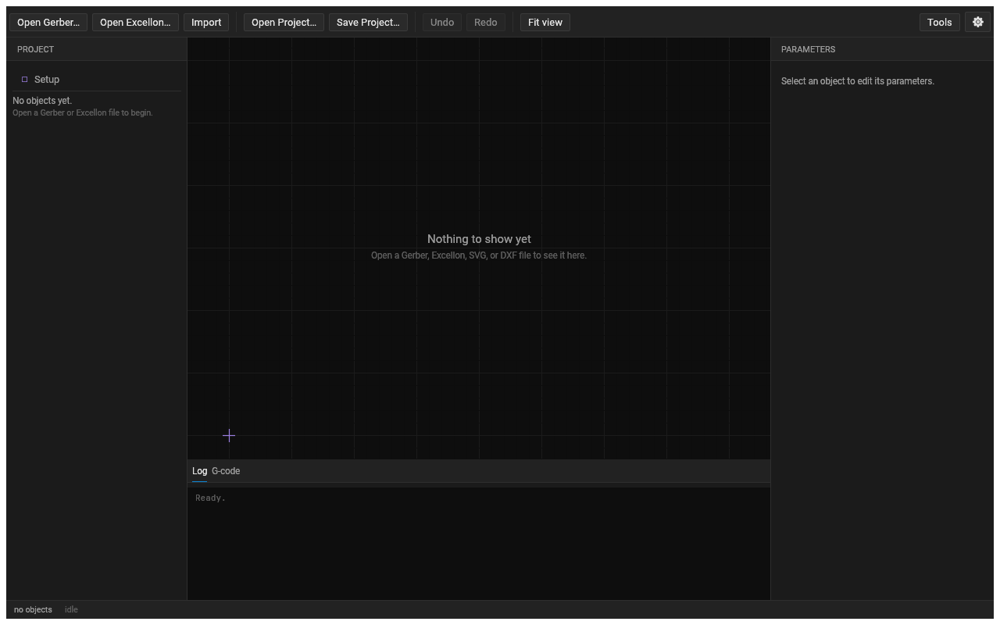
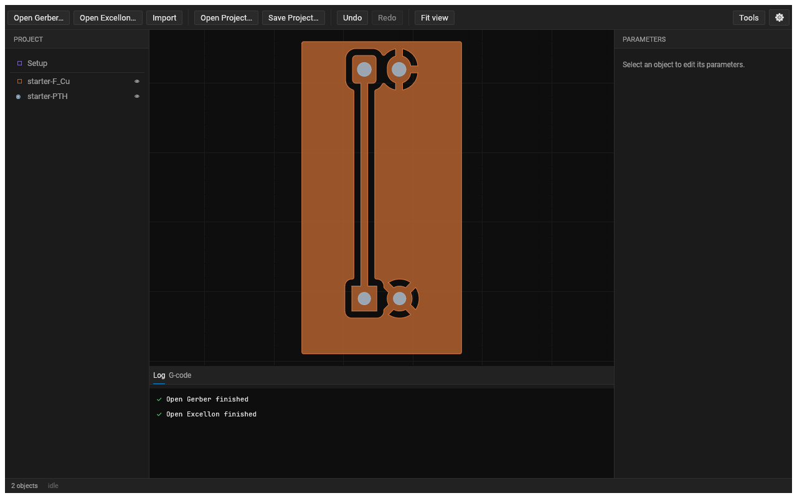
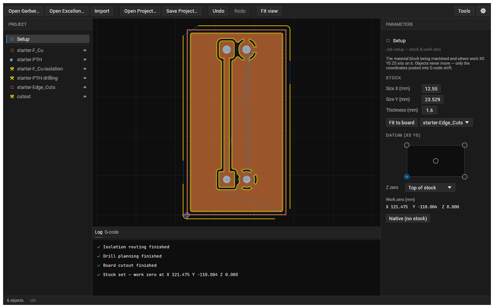
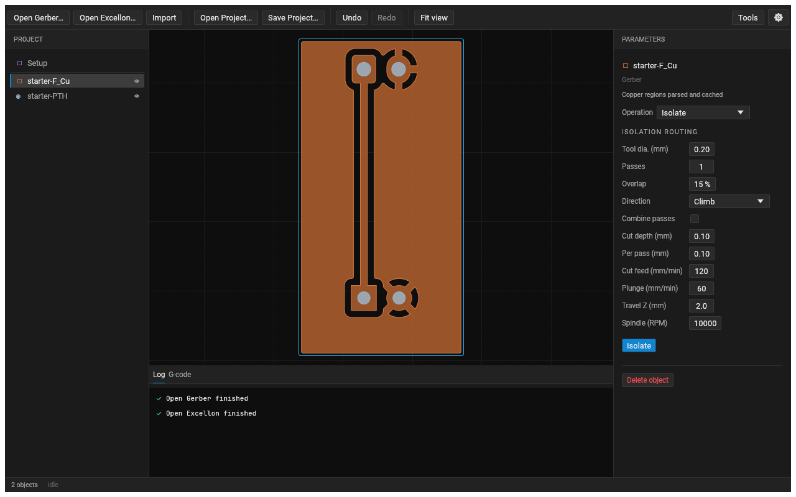
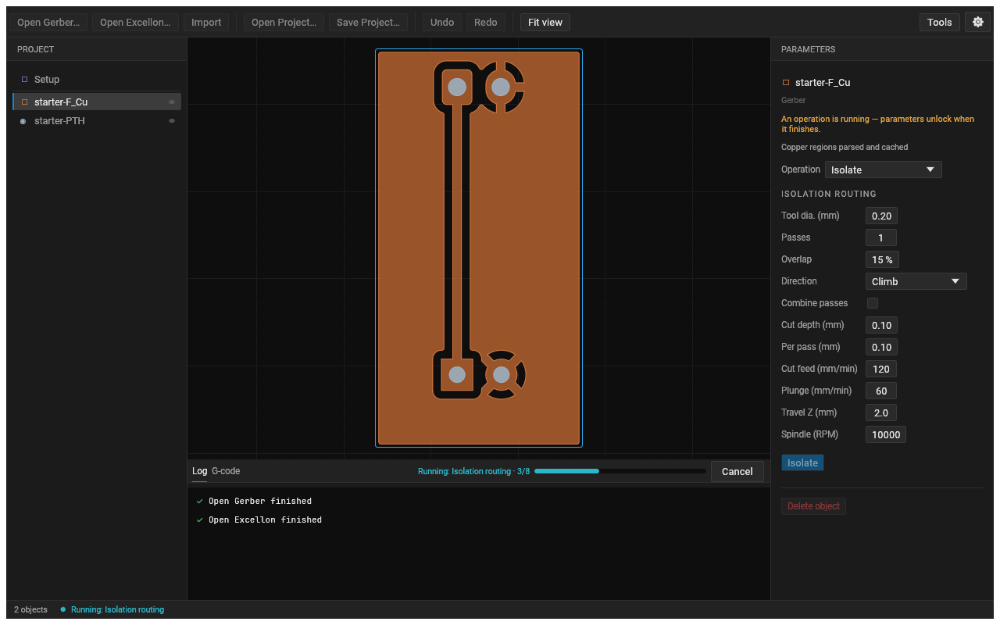
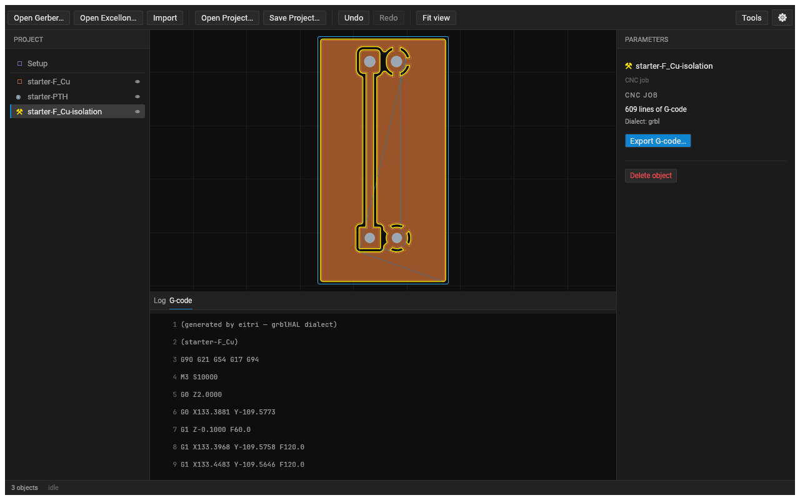
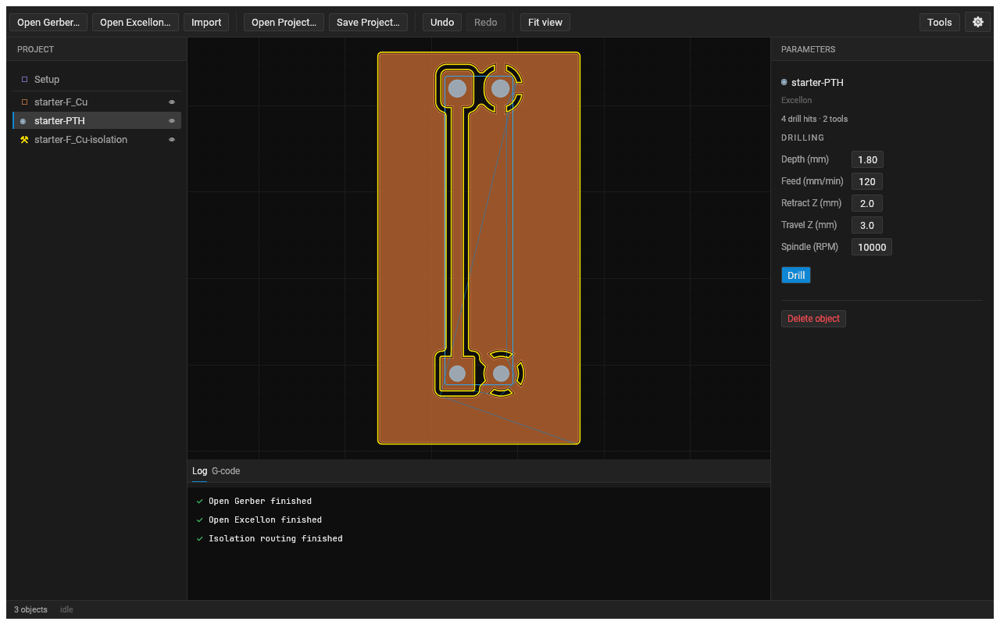
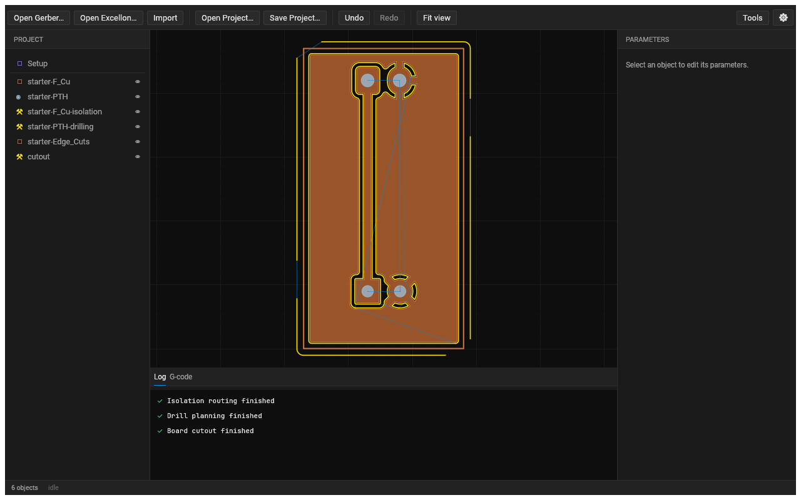
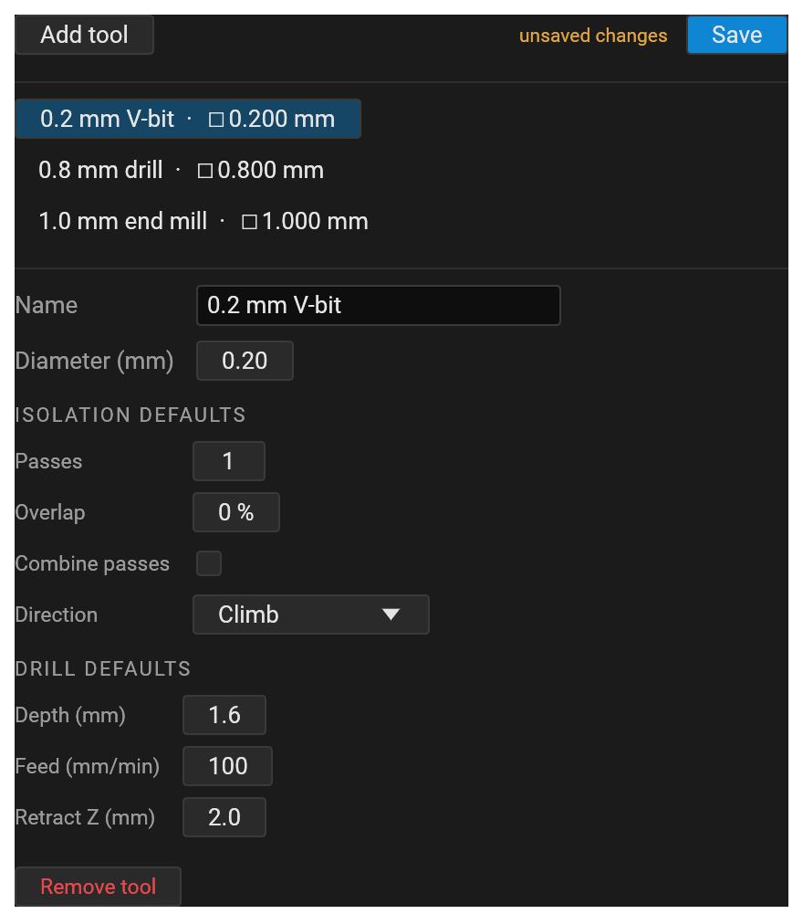

# Milling a PCB end to end with Eitri + Galdr

This tutorial walks a board all the way from fabrication artwork to a finished, milled PCB on the Galdr desktop
CNC. You will:

1. Open a board's **Gerber** (copper) and **Excellon** (drills) files in **Eitri**, the CAM engine.
2. Generate **isolation**, **drilling**, and **cutout** toolpaths and export controller-ready **G-code**.
3. Stream that G-code to the **Galdr** mill with **Skirnir**, the host sender, to cut the board.

The running example is the `starter` board shipped in `eitri/fixtures/` — a small two-layer KiCad board. Every
Eitri screenshot below is that board. If you just want to see the whole CAM pipeline produced headlessly, the same
steps are scripted in [`eitri/crates/eitri-script/examples/starter_board.rs`](../eitri/crates/eitri-script/examples/starter_board.rs):

```sh
cd eitri
cargo run -p eitri-script --example starter_board     # writes 5 grbl-conformant .gcode files
```

---

## The pipeline

```
  KiCad / EDA                Eitri (CAM)                     Skirnir            Galdr
  ───────────                ───────────                     ───────            ─────
  *_F_Cu.gbr   ┐                                          ┌ isolation.gcode ┐
  *_B_Cu.gbr   ├─▶ open ─▶ isolate / drill / cutout ─▶ ───┤ drill.gcode     ├─▶ stream ─▶ mill
  *.drl        ┘           (toolpaths)     export g-code   └ cutout.gcode    ┘  (grblHAL)
  *_Edge_Cuts.gbr
```

Eitri emits **grblHAL 1.1f** G-code — real `G2`/`G3` arcs with `I`/`J` offsets (never flattened), 3-decimal
coordinates, one command per `LF`-terminated line. That is exactly the dialect Skirnir streams and the Galdr firmware
executes, so nothing is re-interpreted between CAM and cut.

---

## What you'll need

**Software**
- **Eitri** — build/run from the nested workspace: `cd eitri && cargo run -p eitri-app`.
- **Skirnir** — the Galdr G-code sender: `cargo run -p skirnir` (from the repo root).

**Files** — export these from your EDA tool (KiCad: *File → Plot* for Gerbers, *Fabrication Outputs → Drill Files*
for Excellon). The `starter` set in `eitri/fixtures/` is:

| File | Layer / role |
|------|--------------|
| `gerber/starter-F_Cu.gbr` | Front copper |
| `gerber/starter-B_Cu.gbr` | Back copper (two-sided boards) |
| `gerber/starter-Edge_Cuts.gbr` | Board outline (cutout) |
| `excellon/starter-PTH.drl` | Plated holes |
| `excellon/starter-NPTH.drl` | Non-plated / mounting holes |

**Hardware & consumables**
- A Galdr mill with a spindle and a probe input.
- Copper-clad FR-4, single- or double-sided, held flat on the bed (double-sided tape or a fixture).
- A spoilboard under the stock (the cutout and drills go all the way through).
- Bits: a small **V-bit or engraving bit** (≈0.1–0.2 mm tip) for isolation, **PCB drills** for the holes, and a
  small (≈1 mm) **end mill** for the cutout.

---

## Part 1 — CAM in Eitri

Launch the app from the eitri workspace:

```sh
cd eitri
cargo run -p eitri-app
```

### 1. First launch

You start with an empty project: the **object tree** on the left, an empty **parameter panel** on the right, and the
**canvas** in the middle inviting you to open a file.



### 2. Open your copper and drills

Open the front-copper Gerber and the drill file (toolbar → *Open Gerber…* and *Open Excellon…*, or drag them in).
Eitri parses each eagerly: the copper is assembled into filled polygons and the drills into a tool table, both drawn
on the canvas and added to the tree. The board is framed automatically.



> **Tip — read the geometry first.** What you see on the canvas *is* what the CAM ops will cut. If a trace looks
> merged or a pad is missing, fix the Gerber before generating toolpaths.

### 3. Set up the stock and datum

The first row in the project tree is a pinned **Setup** node — your job setup. It defines the **stock** (the material
block you're cutting) and the **datum** (where work X0/Y0/Z0 sits on it); every toolpath is posted relative to that
datum. This is the CAM-side equivalent of a Vectric job's Material Setup, and it's why the exported coordinates land
where your machine expects instead of in the EDA plot frame.

**Usually you don't have to touch it.** When you open the first board file, Eitri auto-fills the Setup from it: the
stock footprint becomes the board's bounding box, thickness `1.6 mm`, the datum at the bottom-left corner, Z-zero on
the top surface — logged as *"Stock set — work zero at X … Y … Z …"*. For a standard single-board job that's already
right.

To review or change it, click **Setup** in the tree:

- **Stock** — Size X, Size Y, and Thickness (mm). Edit any field, or click **Fit to board** (with a reference object
  chosen, e.g. `starter-Edge_Cuts`) to re-fit the footprint. Oversize the stock and the board anchors at the datum
  corner.
- **Datum (X0 Y0)** — the corner/centre grid. Click a dot — **bottom-left** is the usual choice; the crosshair jumps
  there and every job is posted so that corner is `(0, 0)`.
- **Z zero** — **Top of stock** (the default — you touch off on the copper surface) or **Bottom of stock** (you touch
  off on the bed, and Eitri lifts every Z by the thickness).
- **Work zero (mm)** — the resolved origin, e.g. `X 121.475  Y -110.004  Z 0.000`.



The canvas draws the stock as a dashed block with the datum crosshair at work-zero. On the machine you zero the tool
once at that physical corner. (**Native (no stock)** falls back to the raw EDA coordinates.)

### 4. Isolation routing

Select the copper object. The right panel switches to the **isolation** parameters. Isolation milling traces the
gaps *around* copper with a fine bit, leaving the traces standing proud. The parameters that matter:

- **Tool diameter** — your V-bit's effective cutting width (e.g. `0.2` mm). This sets how wide each pass clears and
  how tight a gap the bit can reach into.
- **Passes** — how many concentric rings to cut. One pass isolates; extra passes widen the clearance so there is
  less unwanted copper between traces.
- **Overlap** — how much each extra pass overlaps the previous (as a fraction of the tool width).
- **Direction** — climb vs. conventional, which sets the ring winding.

Press **Run** to generate the toolpath.



CAM ops run off the UI thread, so the panel locks and a progress bar with a **Cancel** button appears while the
rings are computed and the G-code is emitted. Larger boards take longer; you can cancel at any time.



When it finishes, a new **CNC job** appears in the tree. Select it and open the **G-code** tab to review the emitted
program — numbered, and exactly what will be sent to the machine. This is real grblHAL output: an `M3` spindle start,
rapids at a safe Z, plunges to the cut depth, and `G1`/`G2`/`G3` cutting moves.



> Depths and feeds live on the **job**, not the geometry. Isolation only needs to cut through the copper foil
> (~35 µm), so the cut depth is small (e.g. `0.15` mm) with a gentle plunge feed. Cutting too deep just widens the
> isolation gap and dulls the tip.

### 5. Drilling

Select the drill (Excellon) object. The panel switches to **drill** parameters:

- **Depth** — a **positive magnitude** below the surface. To drill clean through a 1.6 mm board you want a bit more,
  e.g. `1.8` mm, so the hole breaks fully into the spoilboard.
- **Feed** — the plunge feed rate.
- **Retract** — the height the bit lifts to between holes.
- **Peck** (optional) — plunge in increments to clear chips on deeper holes.

Press **Run**. Eitri orders the holes to minimize rapid travel and emits a drilling program: it groups hits by tool
diameter, prompts a tool change (`M6`) between sizes, and pecks/plunges each hole to depth. (An empty non-plated file
is handled gracefully — it just produces a program with no hits.)



### 6. Board cutout

The cutout routes the board free of the stock along its outline, leaving small **holding tabs** so the finished part
doesn't break loose mid-cut. Configure:

- **Tool diameter** — your cutout end mill (e.g. `1.0` mm).
- **Tabs** — how many uncut bridges to leave, and how wide.
- **Cut depth / pass depth** — the full board thickness, taken in shallow passes (e.g. `1.7` mm total in `0.6` mm
  passes) so you don't overload the little end mill.

The outline comes from the board's `Edge_Cuts` layer (or an explicit rectangle). Run it to get the profiling job.

With isolation, drilling, and the cutout all generated, the tree holds every job and the canvas shows their combined
toolpaths — the complete plan for the board.



### 7. Two-sided boards

For a double-sided board, mill the **back copper** too. The trick is that you machine the back from the *same* side
of the machine after physically flipping the stock left-to-right, so the bottom artwork must be **mirrored** first:

1. Open `starter-B_Cu.gbr`.
2. **Mirror** it about the board's vertical centre line (Eitri derives that line from the `Edge_Cuts` bounds).
3. **Isolate** the mirrored geometry like any other copper.

Drilling and the cutout are done once, from the top, in the original frame — only the back *copper* is mirrored.
When you run the job, you'll flip the board around a registration edge or two alignment pins so the two sides line up.

### 8. The tool database

Rather than retyping tool diameters and feeds for every board, keep them in the **tool database** (*Tools →
Tool Library*). Each entry holds a diameter plus isolation and drilling defaults; selecting a tool seeds the op
parameters. The library persists to disk and is shared across projects.



### 9. Export the G-code

Export each job (*Export G-code…* on a selected job, or *File → Export All*). You'll get one file per operation, in
the order you run them:

```
1-front-copper.gcode
2-back-copper.gcode        (two-sided only)
3-drill-plated.gcode
4-drill-nonplated.gcode    (may be empty)
5-board-cutout.gcode
```

Every file is validated against the grblHAL contract on export, so what you save is what the Galdr will accept.

> **The datum controls where these coordinates land.** By default Eitri keeps your EDA tool's plot frame — for the
> `starter` board that's around `X127 Y-106` (KiCad plots from the page origin, not the board). The
> [Setup node](#3-set-up-the-stock-and-datum) posts every layer and drill file relative to your stock's datum corner
> instead, so the coordinates land on the board near `(0, 0)` and every job shares the same origin. On the machine
> you then just zero the tool at that same corner.

---

## Part 2 — Milling on the Galdr

Now cut the board. Connect the Galdr over USB and open Skirnir (`cargo run -p skirnir`); it auto-detects the port and
streams with character-counting flow control so the firmware's receive buffer never overflows.

### 1. Mount and secure

Stick the copper-clad down onto a flat spoilboard, as flat and level as you can — isolation depth is unforgiving of a
board that isn't parallel to the bed. Fit the V-bit for the first job.

### 2. Home the machine

Run a **homing cycle** (`$H`) so the controller establishes machine zero against the limit switches. Skirnir shows
the endstop indicators; homing gives every subsequent coordinate a repeatable reference — essential if you'll flip
the board for side two.

### 3. Set work zero and probe Z

Jog the spindle to the physical point that corresponds to your **datum** — the stock corner you chose in the
[Setup node](#3-set-up-the-stock-and-datum) — and zero **X/Y** there. Every layer and drill file shares that origin,
so once it's set you don't touch X/Y again between jobs; you only re-probe Z after each tool change.

For **Z**, use Skirnir's **Z-probe** step instead of eyeballing it: with a probe clip on the tool and the copper, a
`G38.2` touch-off finds the copper surface exactly and sets Z zero (the tool-length-offset workflow). Because
isolation only bites tens of microns, a probed Z is the difference between a clean cut and either air-cutting or
ploughing.

### 4. Cut the copper

Load `1-front-copper.gcode` in Skirnir and start the stream. The job spins up the spindle, rapids in, and traces the
isolation rings. Watch the first plunge: if the bit skates without cutting, or digs in, feed-hold, adjust Z zero, and
restart. Use the feed and spindle overrides to dial in the cut without re-posting.

### 5. Drill, then cut out

When isolation finishes, swap to a PCB drill (keep X/Y zero; re-probe Z for the new tool length) and run
`3-drill-plated.gcode`. Then fit the cutout end mill, re-probe Z, and run `5-board-cutout.gcode` last — the tabs keep
the board captive until you snap it free and file the nubs.

### 6. Side two (two-sided boards)

Flip the stock left-to-right about your registration edge/pins, re-establish X/Y zero against the same reference,
re-probe Z, and run `2-back-copper.gcode`. Because that layer was mirrored in CAM, the flipped board now presents the
back copper in the right orientation.

---

## Reference — the starter board parameters

These are the values the scripted [`starter_board`](../eitri/crates/eitri-script/examples/starter_board.rs) example
uses — a sane starting point for a 1.6 mm FR-4 board:

| Operation | Key parameters |
|-----------|----------------|
| Isolation | 0.2 mm tool · 1 pass · climb · cut depth 0.15 mm · plunge 60 / cut 120 mm·min⁻¹ · 10 000 rpm |
| Drilling | depth **1.8 mm** (positive magnitude) · feed 100 · retract 2 mm · 0.6 mm peck · 10 000 rpm |
| Cutout | 1.0 mm end mill · 4 tabs × 3 mm · cut depth 1.7 mm in 0.6 mm passes · cut 200 / plunge 80 · 10 000 rpm |

## Troubleshooting

- **Isolation cuts air or ploughs the board.** Your Z zero or board flatness is off. Re-probe Z; check the stock is
  parallel to the bed. Consider a shallower/deeper cut depth in single-µm steps.
- **Traces are bridged / gaps too tight.** Add an isolation pass or a small overlap so the bit clears more copper
  between traces; verify your tool-diameter figure matches the bit's real cutting width.
- **Drill breaks through unevenly.** Increase depth so every hole clears into the spoilboard, and enable pecking on
  deeper holes to clear chips.
- **Board shifts during cutout.** More/wider tabs, shallower passes, or better workholding.
- **A CAM file won't run.** Eitri validates every export against the grblHAL contract, so a rejected line is almost
  always an unsupported code upstream — re-export from Eitri rather than hand-editing G-code.

## See also

- [`eitri-gcode-skirnir-contract.md`](eitri-gcode-skirnir-contract.md) — the exact grblHAL 1.1f wire contract Eitri
  emits against.
- [`tlo-offsets.md`](tlo-offsets.md) — the Z-probe / tool-length-offset workflow used for work zero.
- [`gcode-streaming.md`](gcode-streaming.md) — how Skirnir streams to the Galdr firmware.
